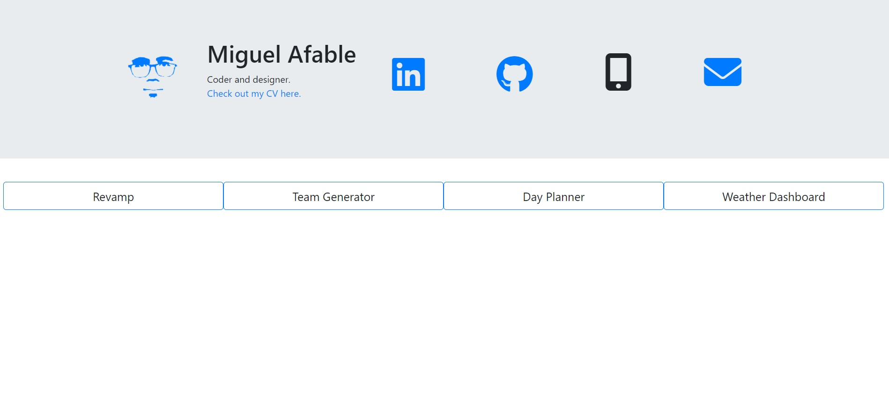

# Profile Page

## Summary
About me, plus Github project showcase. 

## Description
Basic website: Header contains links to Github, LinkedIn, mobile number and email.

Clicking on Github and LinkedIn icons opens new tabs redirecting to websites. 

Mobile number link creates copied text. 

Email link creates email link (or prompt to email link) in new tab.

Buttons below the navbar drops down projects. 

Each project has a Github repo link and description. 

Clicking on the project image will lead to that project website, if available. 

## Contact
grimdango@gmail.com

## Log 
### 31/03/22
README updated. 

### 25-29/03/22
Structuring and completion of website.   

### 24/03/22
First commit. 
   

